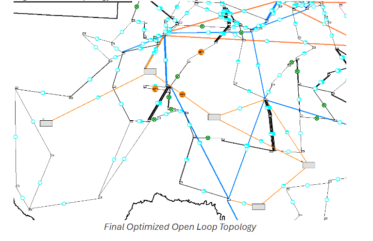
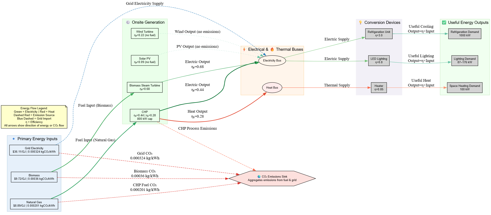
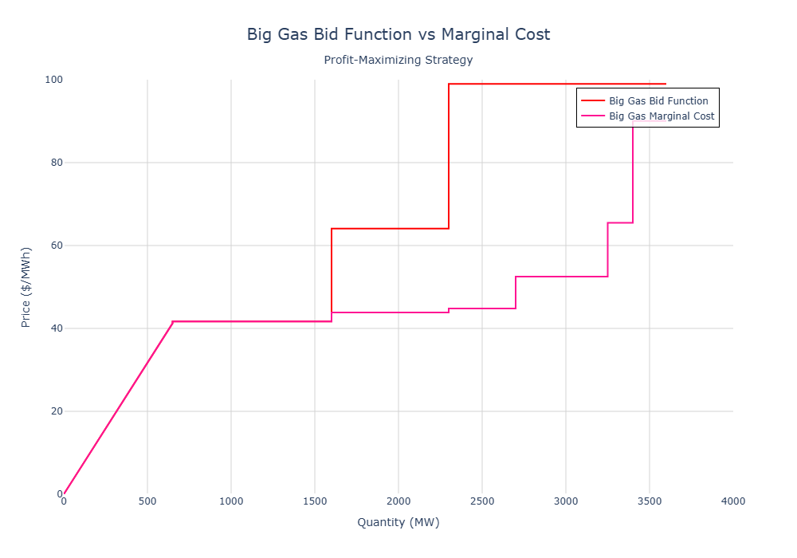
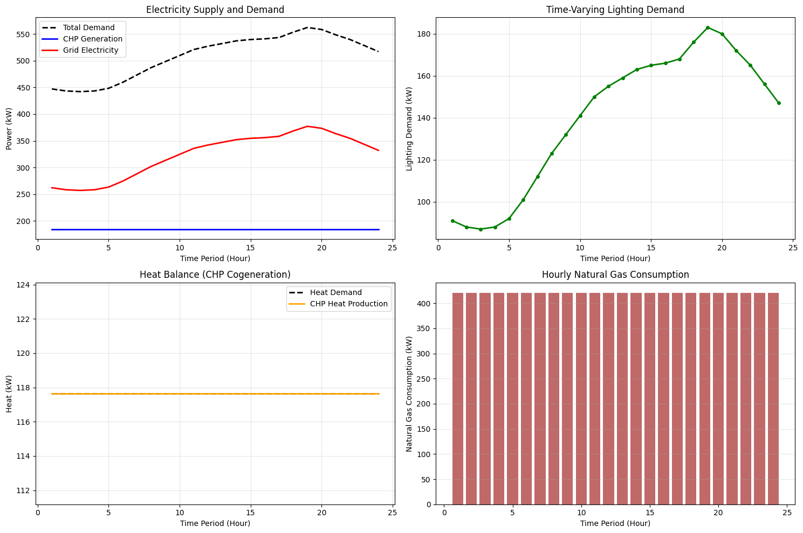
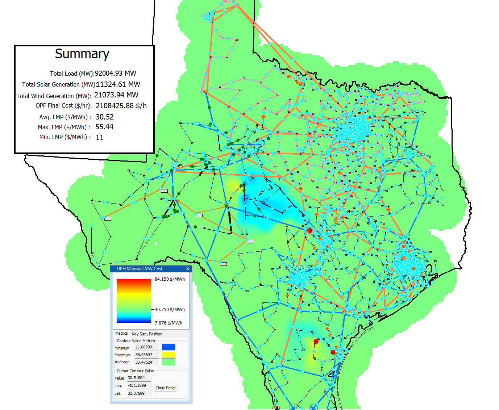
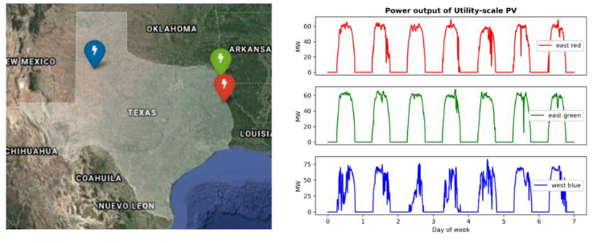
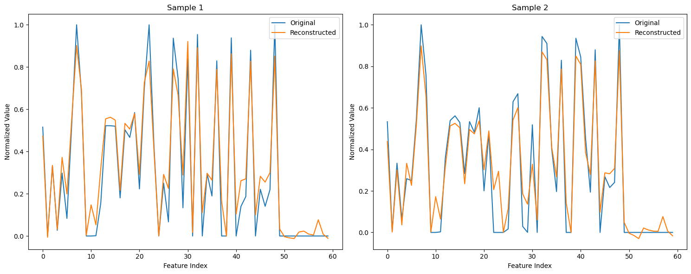

# TAMU MS Energy Project Portfolio

Welcome to my portfolio page for the Master of Science in Energy degree I am completing at Texas A&M! Over the course of the program, I have prototyped data-driven workflows, built optimization models, and delivered power system planning studies. Each section below links directly to the project artifacts, summarizing the problem tackled, the methods employed, and the skills demonstrated.

## 🌟 Featured Projects at a Glance

|     [**Grid Expansion Planning**](texas-synthetic-west-texas-load-design-project/)      |       [**Microgrid Optimization**](energy-system-design-and-scheduling/)       |     [**Market Bidding Strategy**](electricity-auction-bidding/)     |
| :-------------------------------------------------------------------------------------: | :----------------------------------------------------------------------------: | :-----------------------------------------------------------------: |
|  |  |    |
|          _Designed a 500 kV corridor for 5 GW load integration in West Texas_           |     _Multi-objective MILP optimization for cost vs. emissions trade-offs_      | _Profit-maximizing bid curves for competitive electricity auctions_ |

---

## 📚 Table of Contents

- [Energy System Design and Scheduling (ENGY 604)](#energy-system-design-and-scheduling-engy-604)
- [Texas Synthetic Grid Load Siting Study (ECEN 615)](#texas-synthetic-grid-load-siting-study-ecen-615)
- [Electricity Auction Bidding Strategy (ENGY 615)](#electricity-auction-bidding-strategy-engy-615)
- [Data Science for Power Systems (ENGY 643)](#data-science-for-power-systems-engy-643)
- [Data Science for Process Systems (ENGY 644)](#data-science-for-process-systems-engy-644)
- [Newton-Raphson Power Flow Solver (ECEN 615)](#newton-raphson-power-flow-solver-ecen-615)
- [Advanced Concepts in Machine Learning for Energy (ENGY 642)](#advanced-concepts-in-machine-learning-for-energy-engy-642)
- [Data Science Fundamentals for Energy (ENGY 641)](#data-science-fundamentals-for-energy-engy-641)

---

## [Energy System Design and Scheduling (ENGY 604)](energy-system-design-and-scheduling/)

Formulated mixed-integer linear programs for a grid-connected microgrid, delivered Pyomo implementations, and ran epsilon-constraint analyses to balance cost, emissions, and reliability objectives.

$$
\min Z_{\text{COST}} = \underbrace{\sum_{t \in T} \sum_{g \in G} \left(P_{g,t}^{\text{elec}} \cdot \Delta t \cdot \text{opex}_g\right)}_{\text{Generator Operating Cost}} + \underbrace{\sum_{t \in T} \sum_{r \in R} \left(P_{r,t}^{\text{cons}} \cdot \Delta t \cdot \text{Price}_r\right)}_{\text{Resource (Fuel) Cost}}
$$

- Highlights: Built technology selection and dispatch MILP formulations, encoded them in Pyomo with scenario management, and traced Pareto-optimal frontiers for stakeholder trade-offs.

- Key Assets:
  - [energy-system-design-and-scheduling/MILP_Problem_Formulation_Part_A.pdf](energy-system-design-and-scheduling/MILP_Problem_Formulation_Part_A.pdf)
  - [energy-system-design-and-scheduling/MILP_Problem_Formulation_Part_B.pdf](energy-system-design-and-scheduling/MILP_Problem_Formulation_Part_B.pdf)
  - [energy-system-design-and-scheduling/solution_matt_partA_pyomo.ipynb](energy-system-design-and-scheduling/solution_matt_partA_pyomo.ipynb)
  - [energy-system-design-and-scheduling/solution_matt_partB_pyomo.ipynb](energy-system-design-and-scheduling/solution_matt_partB_pyomo.ipynb)

---

## [Texas Synthetic Grid Load Siting Study (ECEN 615)](texas-synthetic-west-texas-load-design-project/)

Conducted a transmission planning assessment for integrating five 1 GW loads in West Texas, using DC-OPF studies and PowerWorld simulation artifacts to justify corridor and siting recommendations.

- Highlights: Designed a 500 kV open-loop expansion corridor, evaluated contingency scenarios, and compiled deliverables suitable for executive review.

- Key Assets:
  - [texas-synthetic-west-texas-load-design-project/ECEN_615_Fall2025_Design_Project_Report.pdf](texas-synthetic-west-texas-load-design-project/ECEN_615_Fall2025_Design_Project_Report.pdf)
  - [texas-synthetic-west-texas-load-design-project/final_design.png](texas-synthetic-west-texas-load-design-project/final_design.png)
  - [texas-synthetic-west-texas-load-design-project/submission_details/ProjectCostTracking.xlsx](texas-synthetic-west-texas-load-design-project/submission_details/ProjectCostTracking.xlsx)

---

## [Electricity Auction Bidding Strategy (ENGY 615)](electricity-auction-bidding/)

Designed a profit-maximizing bidding function for a natural gas generator participating in a single-round electricity auction, incorporating cost curves, market rules, and uncertainty handling.

- Highlights: Derived marginal cost-based bidding logic, and generated actionable bid curves for plant operators.

- Key Assets:
  - [electricity-auction-bidding/profit-maximizing-bid-function.ipynb](electricity-auction-bidding/profit-maximizing-bid-function.ipynb)
  - [electricity-auction-bidding/report.pdf](electricity-auction-bidding/report.pdf)

---

## [Data Science for Power Systems (ENGY 643)](data-science-power-systems/)

Explored grid-focused machine learning use cases, from solar forecasting diagnostics to ancillary service price modeling, with an emphasis on time-series feature engineering.

- Highlights: Measured cross-correlations between production zones, and trained Random Forest models for RegUp offer classification.

- Key Assets:
  - [data-science-power-systems/HW_part_3_solar_data_correlation.ipynb](data-science-power-systems/HW_part_3_solar_data_correlation.ipynb)
  - [data-science-power-systems/HW_Bonus_1_ercot_regup.ipynb](data-science-power-systems/HW_Bonus_1_ercot_regup.ipynb)

---

## [Data Science for Process Systems (ENGY 644)](data-science-process-systems/)

Combined physics-based control design with data-driven modeling for complex energy processes, highlighting hybrid MPC workflows.

- Highlights: Implemented input-output feedback linearization, created hybrid ML-physical models for an SMR case study, and evaluated MPC-driven microgrid scheduling scenarios.
- Key Assets:
  - [data-science-process-systems/644_HW_1_solution.pdf](data-science-process-systems/644_HW_1_solution.pdf)
  - [data-science-process-systems/644_HW_2_solution.pdf](data-science-process-systems/644_HW_2_solution.pdf)
  - [data-science-process-systems/644_Final_Project_solution.pdf](data-science-process-systems/644_Final_Project_solution.pdf)

---

## [Newton-Raphson Power Flow Solver (ECEN 615)](newton-raphson-solver/)

Implemented a from-scratch Newton-Raphson AC power flow solver with LU decomposition, admittance matrix construction, and detailed convergence diagnostics for instructional case studies.

- Highlights: Programmed block-Jacobian assembly for PV/PQ buses, scripted custom LU factorization routines, and produced iterative mismatch reporting.
- Key Assets:
  - [newton-raphson-solver/solver.py](newton-raphson-solver/solver.py)
  - [newton-raphson-solver/five_bus_solver_output.txt](newton-raphson-solver/five_bus_solver_output.txt)
  - [newton-raphson-solver/five_bus_example/data.py](newton-raphson-solver/five_bus_example/data.py)

---

## [Advanced Concepts in Machine Learning for Energy (ENGY 642)](advanced-concepts-machine-learning/)

Developed GPU-accelerated anomaly detection pipelines for timeseries energy meter data, comparing traditional scikit-learn workflows with NVIDIA RAPIDS to benchmark performance and scalability.

- Highlights: Tuned autoencoder architectures for sparse anomalies, quantified reconstruction error thresholds, and plotted ROC curve to evalute network performance.

- Key Asset: [advanced-concepts-machine-learning/Final_Project_Track_2_energy_anomaly_detection.ipynb](advanced-concepts-machine-learning/Final_Project_Track_2_energy_anomaly_detection.ipynb)

---

## [Data Science Fundamentals for Energy (ENGY 641)](data-science-fundamentals-for-energy-predictive-modeling/)

Practiced foundational predictive modeling techniques on public datasets, emphasizing reproducible experimentation, hyperparameter selection, and interpretability for energy-focused stakeholders.

- Highlights: Applied the elbow method to k-means cluster studies, contrasted ridge versus ordinary least squares regressors, and benchmarked ensemble (random forest) classifiers against SVM baselines.

  
  

- Key Assets:
  - [data-science-fundamentals-for-energy-predictive-modeling/[ICPE 641]\_HW_1_kmeans.ipynb](data-science-fundamentals-for-energy-predictive-modeling/%5BICPE%20641%5D_HW_1_kmeans.ipynb)
  - [data-science-fundamentals-for-energy-predictive-modeling/[ICPE 641]\_HW_2_ridge_regression.ipynb](data-science-fundamentals-for-energy-predictive-modeling/%5BICPE%20641%5D_HW_2_ridge_regression.ipynb)
  - [data-science-fundamentals-for-energy-predictive-modeling/[ICPE_641]\_Final_Project_classifiers.ipynb](data-science-fundamentals-for-energy-predictive-modeling/%5BICPE_641%5D_Final_Project_classifiers.ipynb)

---

## How to Navigate

Each notebook or script includes inline commentary, data sources, and reproducibility notes. Start with the project summaries above, then open the linked artifacts for implementation detail, results, and scenario analyses.
