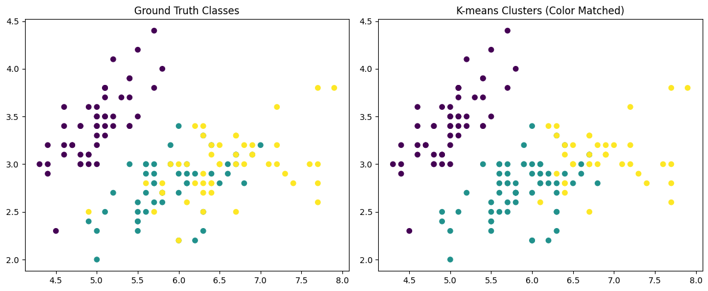
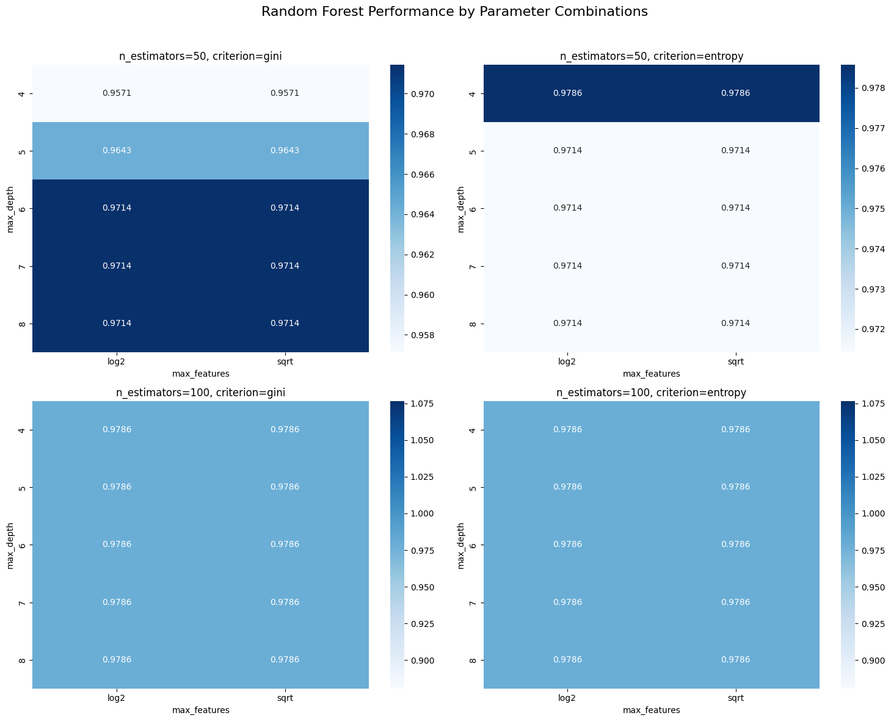

# Data Science Fundamentals for Energy - Predictive Modeling

A collection of data science notebooks for the ENGY 641 class.

##

Description:

1.  [ICPE 641]\_HW_1_kmeans: A notebook that explores K-means clustering techniques on the iris dataset. Uses elbow method to get the optimal value of K
2.  [ICPE 641]\_HW_2_ridge_regression: This notebook explores a standard dataset and compares multiple linear and ridge regression techniques
3.  [ICPE_641]\_Final_Project_random_forest: This final project explores the performance of random forest, SVM, and k-means classifiers on a test dataset.

## Visualizations

### K-means Clustering Results

### Classifier Confusion Matrix

