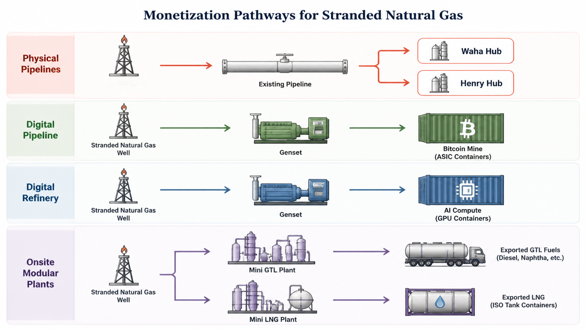

# Natural Gas Monetization Report

This is a report I created to showcase different ways that stranded natural gas might be repurposed to be more economically useful. I did a comparison of traditional pipelines, new digital monetization methods, and newer LNG and GTL technologies, as well as a high-level economic analysis to get a rough estimate of what the expected revenue might be for each.

